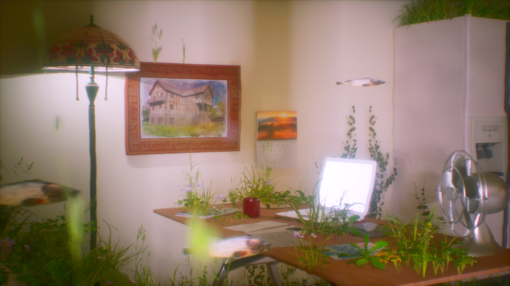
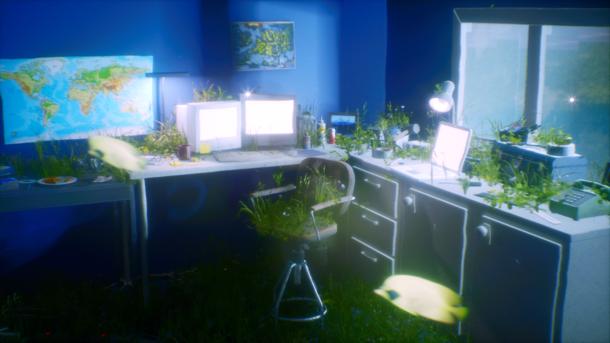
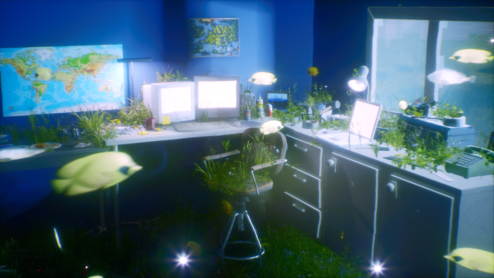
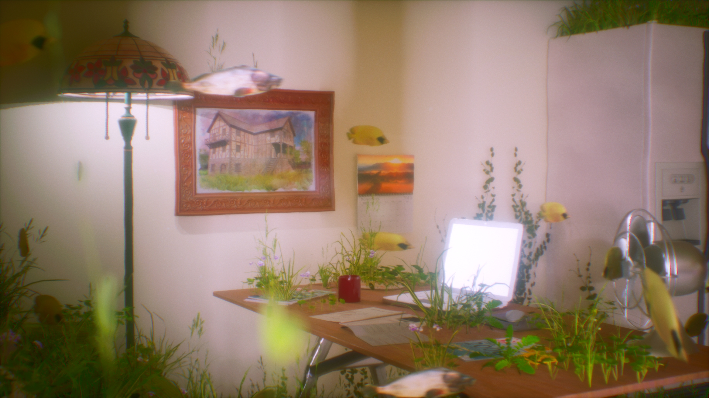
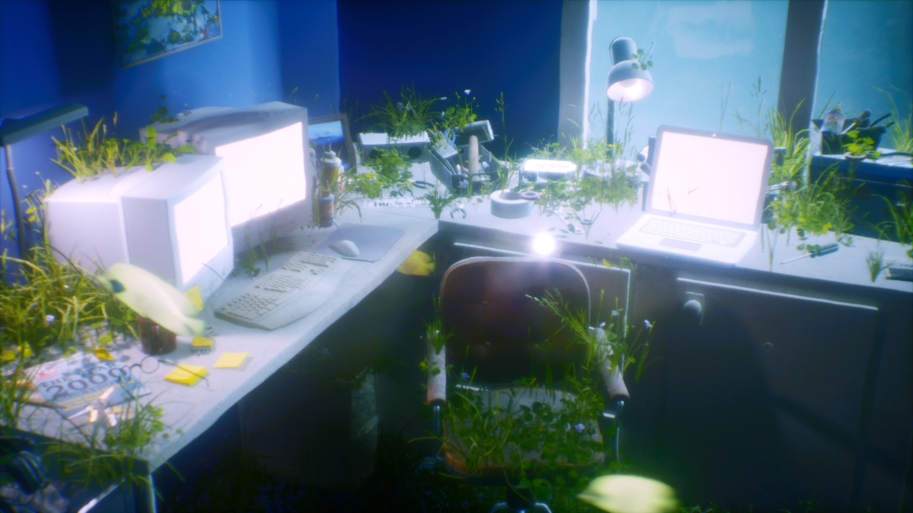
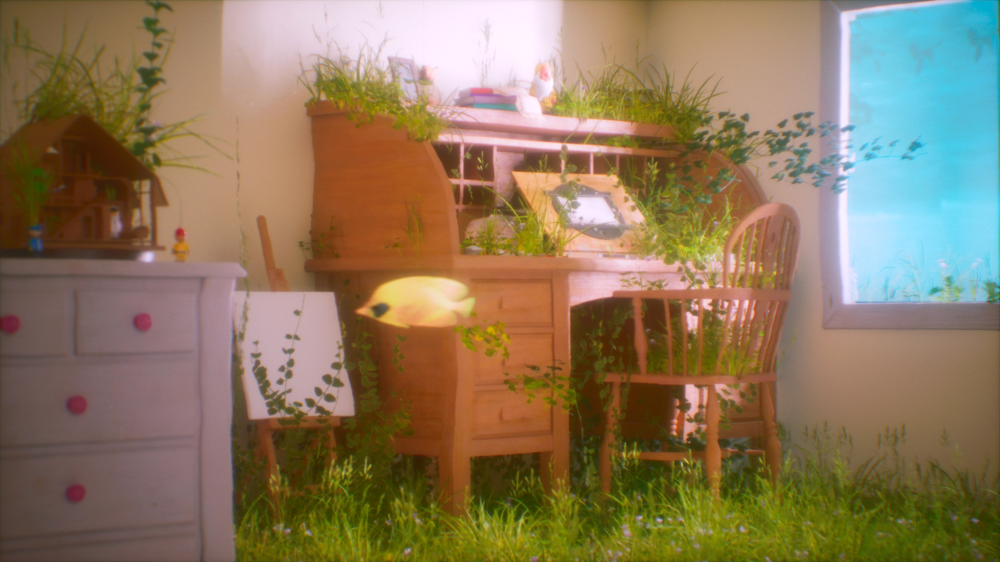
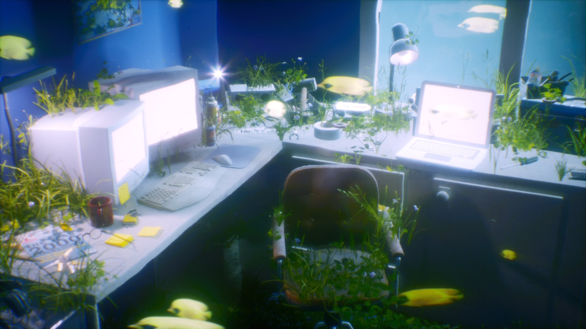
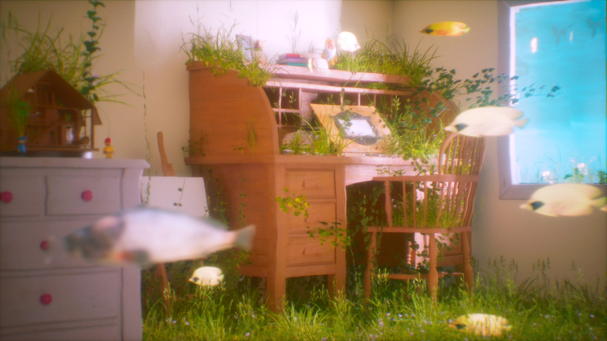
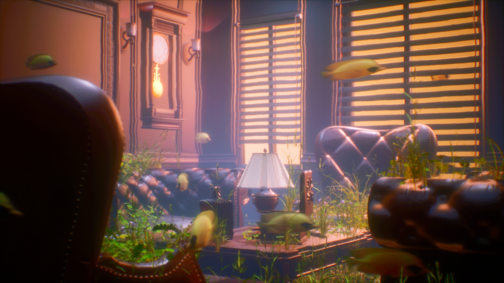

# 2024_Unreal_GBD

## 2024년도 4학년 1학기 게임환경디자인 수업

### 프로젝트 소개
UnrealEngine을 활용하여 다양한 게임 환경을 설계하고, 그 배경을 바탕으로 영상 제작    

### 작업 내용
**환경 설계**: 게임 환경 내 월드와 씬을 기획 및 설계  
**영상 제작**: 환경을 가장 효율적이고 보기 좋게 담아낼 수 있도록 카메라 세팅과 조명 등 효과 세팅 후 영상 제작  

### 결과물
- UnrealEngine을 활용한 게임 환경 구현을 경험  
- 가장 효율적이고, 게임 환경을 극적으로 보일 수 있게 하는 전반적인 공부

### [기말 과제 영상](https://youtu.be/jVIqNm7P7HE)

  
  
  
  
  
  
  
  

---

# 2024_Unreal_GBD

## Game Environment Design Course, Spring 2024 (Senior Year)

### Project Overview  
Designed diverse game environments using Unreal Engine and created videos based on these backgrounds.  

### Work Details  
**Environment Design**: Planned and developed worlds and scenes within the game environment  
**Video Production**: Set up cameras, lighting, and effects to capture the environment efficiently and aesthetically  

### Outcome  
- Gained hands-on experience in implementing game environments with Unreal Engine  
- Studied techniques to present game environments in a dramatic and effective way  

### [Final Video](https://youtu.be/jVIqNm7P7HE)

---

# 2024_Unreal_GBD

## 2024年 2学期 ゲーム環境デザイン授業

### プロジェクト概要  
Unreal Engineを使用して多様なゲーム環境を設計し、それを基に映像を制作しました。  

### 作業内容  
**環境設計**: ゲーム環境内のワールドやシーンを企画および設計  
**映像制作**: 環境を効率的で魅力的に表現するため、カメラ設定や照明、エフェクトを調整し映像を制作  

### 成果  
- Unreal Engineを活用したゲーム環境の実装を体験  
- ゲーム環境を劇的かつ効果的に見せる技術を学習  

### [期末映像](https://youtu.be/jVIqNm7P7HE)
